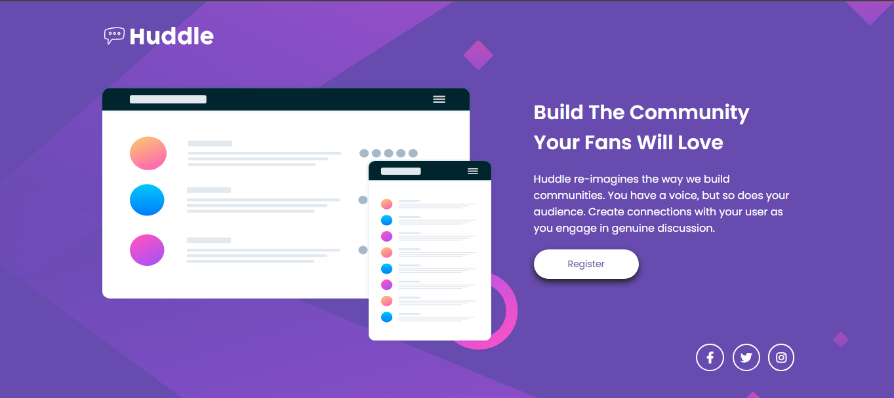

# Huddle Landing Page

## Linguagens Usadas

- HTML 

- CSS 

## Prévia



## Propósito da aplicação

Peguei esse projeto no Frontend Mentor com o intuito de demonstrar que consigo fazer uma landing page atrativa e interativa.

## Passo a passo para clonar o projeto

Irei deixar o projeto no GitHub pages, mas se quiser acessar na sua maquina basta seguir o passo a passo a seguir.

Os passos estão seguidos de seus respectivos comandos para facilitar no entendimento.

1 - Clone o projeto
```
git clone "url do projeto"
```
2 - Acesse a pasta do projeto
```
cd quest-projeto-huddle-landing-page
```
3 - Abra o projeto no VScode
```
code .
```